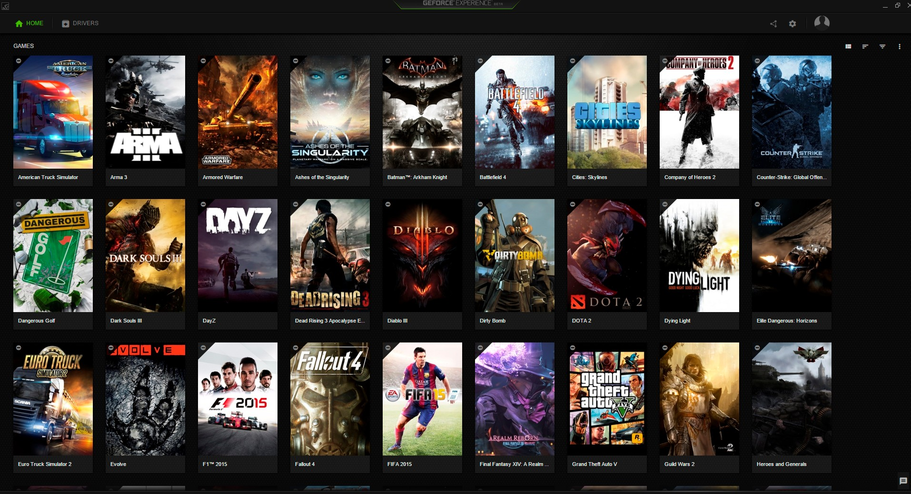

# PC Games I've played! (User files / save files & Screenshots)

### My Rig

|Year|Rig|
| ----------- | ----------- |
| 2008 | Intel® Pentium® 4 2.40 GHz Intel® Extreme Graphics 64 MB 256 MB 333 MHz DDR1 40 GB 7200 RPM 3.5" IDE 19" CRT Windows XP SP 2|
| 2011 | Intel® Pentium® 4 3.00 GHz NVIDIA® GeForce FX 5200 128 MB 1 GB 400 MHz DDR1 160 GB 7200 RPM 3.5" IDE 15" LCD Windows XP SP 3|
| 2012 - 2015 |Different different laptops (Acer Aspire One, Toshiba Satellite)|
| 2015 | Lenovo G50-80 Intel® Core™ i5 5200U Intel® HD Graphics 5500 4 GB 1600 MHz DDR3 1 TB 5400 RPM 15.6" LCD HD Windows 10|
| 2016 | Acer Aspire E5-575G Intel® Core™ i5 6200U NVIDIA® GeForce® 940MX 2GB 8 GB 2133 MHz DDR4 1 TB 5400 RPM 15.6" LCD FHD Windows 10|
| 2020 | Acer Predator PH315-52 Intel® Core™ i7-9750H NVIDIA® GeForce® RTX™ 2060 6GB 16 GB 2666 MHz DDR4 256 GB NVMe + 1 TB 7200 RPM 15.6" LCD IPS FHD 144Hz Windows 10|

#### Interested in Movies / TV Series? [My Movie Database](https://github.com/tdwns/emdb)

### List
`* marked - best games ❤️`
 
 
[Alan Wake Remastered](Alan%20Wake%20Remastered/readme.md)

[Sniper Ghost Warrior Contracts 2](Sniper%20Ghost%20Warrior%20Contracts%202/readme.md)

[Far Cry 6](Far%20Cry%205/readme.md)

[Death Stranding *](Death%20Stranding/readme.md)

[Tom Clancy's Ghost Recon - Wildlands *](Tom%20Clancy's%20Ghost%20Recon%20-%20Wildlands/readme.md)

[Far Cry New Dawn](Far%20Cry%20New%20Dawn/readme.md)

[Sniper Ghost Warrior Contracts](Sniper%20Ghost%20Warrior%20Contracts/readme.md)

[Beyond Two Souls *](Beyond%20Two%20Souls/readme.md)

[Titanfall 2 *](Titanfall%202/readme.md)

[Detroit Become Human *](Detroit%20Become%20Human/readme.md)

[Quantum Break *](Quantum%20Break/readme.md)

[Far Cry 5 - Gold Edition](Far%20Cry%205/readme.md)

[Sniper Ghost Warrior 3 *](Sniper%20Ghost%20Warrior%203/readme.md)

[Cyberpunk 2077 *](Cyberpunk%202077/readme.md)

[BioShock Infinite - GOTY Edition *](BioShock%20Infinite%20-%20GOTY%20Edition/readme.md)

[BioShock 2 Remastered *](BioShock%202%20Remastered/readme.md)

[BioShock Remastered *](BioShock%20Remastered/readme.md)

[Mafia Definitive Edition *](Mafia%20Definitive%20Edition/readme.md)

[Watch Dogs 2](Watch%20Dogs%202/readme.md)

[Far Cry 4 *](Far%20Cry%204/readme.md)

[Shadow of the Tomb Raider *](Shadow%20of%20the%20Tomb%20Raider/readme.md)

[Far Cry 3 *](Far%20Cry%203/readme.md)

[Control *](Control/readme.md)

[Watch_Dogs *](Watch_Dogs/readme.md)

[Max Max *](Max%20Max/readme.md)

[Need for Speed Heat](Need%20for%20Speed%20Heat/readme.md)

[Call of Duty Modern Warfare 3 *](Call%20of%20Duty%20Modern%20Warfare%203/readme.md)

[Call of Duty Modern Warfare 2 *](Call%20of%20Duty%20Modern%20Warfare%202/readme.md)

[Battlefield 1 *](Battlefield%201/readme.md)

[Call of Duty Modern Warfare *](Call%20of%20Duty%20Modern%20Warfare/readme.md)

[Tom Clancy's Splinter Cell Blacklist](Tom%20Clancy's%20Splinter%20Cell%20Blacklist/readme.md)

[Tom Clancy's Ghost Recon Future Soldier](Tom%20Clancy's%20Ghost%20Recon%20Future%20Soldier/readme.md)

[Test Drive Unlimited 2](Test%20Drive%20Unlimited%202/readme.md)

[Splinter Cell Conviction](Splinter%20Cell%20Conviction/readme.md)

[Split Second Velocity](Split%20Second%20Velocity/readme.md)

[SpecOps-TheLine *](SpecOps-TheLine/readme.md)

[Sniper Ghost Warrior 2 *](Sniper%20Ghost%20Warrior%202/readme.md)

[Sniper Elite 4 *](Sniper%20Elite%204/readme.md)

[Sniper Art of Victory](Sniper%20Art%20of%20Victory/readme.md)

[Robocop](Robocop/readme.md)

[Rise of the Tomb Raider *](Rise%20of%20the%20Tomb%20Raider/readme.md)

[Rig n Roll](Rig%20n%20Roll/readme.md)

[Ridge Racer Unbounded](Ridge%20Racer%20Unbounded/readme.md)

[Rainbow Six - Siege](Rainbow%20Six%20-%20Siege/readme.md)

[Ori and the Blind Forest *](Ori%20and%20the%20Blind%20Forest/readme.md)

[Need for Speed Underground 2 *](Need%20for%20Speed%20Underground%202/readme.md)

[Need for Speed Underground 1](Need%20for%20Speed%20Underground%201/readme.md)

[Need for Speed Undercover](Need%20for%20Speed%20Undercover/readme.md)

[Need for Speed The Run *](Need%20for%20Speed%20The%20Run/readme.md)

[Need for Speed Rivals *](Need%20for%20Speed%20Rivals/readme.md)

[Need for Speed Payback *](Need%20for%20Speed%20Payback/readme.md)

[Need for Speed Most Wanted *](Need%20for%20Speed%20Most%20Wanted/readme.md)

[Need for Speed Most Wanted 2012](Need%20for%20Speed%20Most%20Wanted%202012/readme.md)

[Need for Speed Hot Pursuit 2010 *](Need%20for%20Speed%20Hot%20Pursuit%202010/readme.md)

[Need for Speed 2 (II) SE](Need%20for%20Speed%202%20(II)%20SE/readme.md)

[Need for Speed Carbon *](Need%20for%20Speed%20Carbon/readme.md)

[Metal Gear Solid V - The Phantom Pain *](Metal%20Gear%20Solid%20V%20-%20The%20Phantom%20Pain/readme.md)

[Medal of Honor Warfighter](Medal%20of%20Honor%20Warfighter/readme.md)

[Mass Effect 3](Mass%20Effect%203/readme.md)

[King of the Road *](King%20of%20the%20Road/readme.md)

[Just Cause 2](Just%20Cause%202/readme.md)

[IGI 2 *](IGI%202/readme.md)

[IGI 1](IGI%201/readme.md)

[Harry Potter and the Prisoner of Azkaban](Harry%20Potter%20and%20the%20Prisoner%20of%20Azkaban/readme.md)

[Harry Potter and the Half-Blood Prince](Harry%20Potter%20and%20the%20Half-Blood%20Prince/readme.md)

[Harry Potter and the Order of the Phoenix](Harry%20Potter%20and%20the%20Order%20of%20the%20Phoenix/readme.md)

[Harry Potter and the Goblet of Fire](Harry%20Potter%20and%20the%20Goblet%20of%20Fire/readme.md)

[Harry Potter and the Deathly Hallows (TM) – Part 1](Harry%20Potter%20and%20the%20Deathly%20Hallows%20(TM)%20–%20Part%201/readme.md)

[Harry Potter and the Chamber of Secrets](Harry%20Potter%20and%20the%20Chamber%20of%20Secrets/readme.md)

[HOMEFRONT](HOMEFRONT/readme.md)

[Grand Theft Auto Vice City *](Grand%20Theft%20Auto%20Vice%20City/readme.md)

[Grand Theft Auto San Andreas *](Grand%20Theft%20Auto%20San%20Andreas/readme.md)

[German Truck Simulator](German%20Truck%20Simulator/readme.md)

[Flatout 4](Flatout%204/readme.md)

[Euro Truck Simulator](Euro%20Truck%20Simulator/readme.md)

[Euro Truck Simulator 2](Euro%20Truck%20Simulator%202/readme.md)

[Crysis 3 *](Crysis%203/readme.md)

[Company of Heroes](Company%20of%20Heroes/readme.md)

[Call of Duty World at War](Call%20of%20Duty%20World%20at%20War/readme.md)

[Call of Duty WWII *](Call%20of%20Duty%20WWII/readme.md)

[Call of Duty United Offensive](Call%20of%20Duty%20United%20Offensive/readme.md)

[Call of Duty Infinite Warfare](Call%20of%20Duty%20Infinite%20Warfare/readme.md)

[Call of Duty Ghosts *](Call%20of%20Duty%20Ghosts/readme.md)

[Call of Duty Black Ops *](Call%20of%20Duty%20Black%20Ops/readme.md)

[Call of Duty Black Ops II *](Call%20of%20Duty%20Black%20Ops%20II/readme.md)

[Call of Duty Black Ops 3 *](Call%20of%20Duty%20Black%20Ops%203/readme.md)

[Call of Duty Advanced Warfare *](Call%20of%20Duty%20Advanced%20Warfare/readme.md)

[Call of Duty 1](Call%20of%20Duty%201/readme.md)

[Bus Driver](Bus%20Driver/readme.md)

[Battlefield V *](Battlefield%20V/readme.md)

[Battlefield Hardline *](Battlefield%20Hardline/readme.md)

[Battlefield Bad Company 2 *](Battlefield%20Bad%20Company%202/readme.md)

[Battlefield 4 *](Battlefield%204/readme.md)

[Battlefield 3 *](Battlefield%203/readme.md)

[BATMAN](BATMAN/readme.md)

[Army Ranger - Mogadishu](Army%20Ranger%20-%20Mogadishu/readme.md)

[Arma 3](Arma%203/readme.md)

[18 Wheels of Steel Extreme Trucker](18%20Wheels%20of%20Steel%20Extreme%20Trucker/readme.md)

